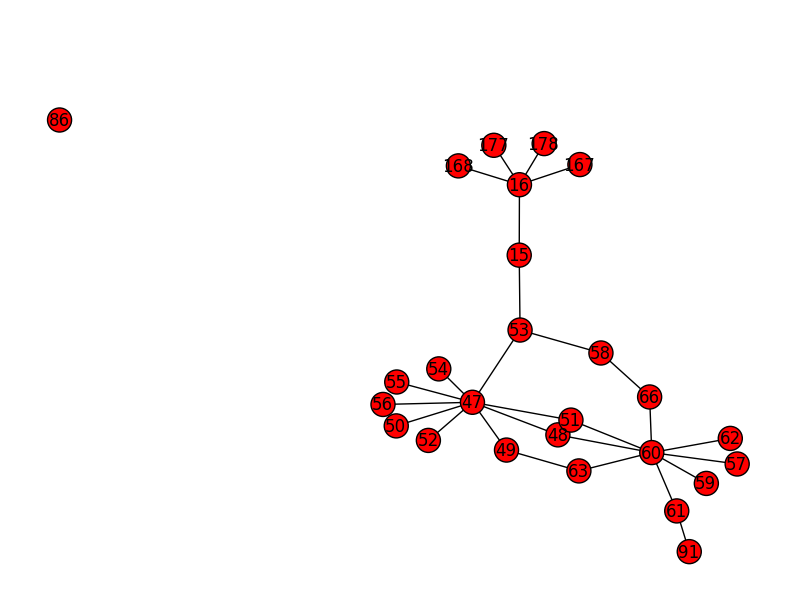

# Intro 

Right after watching @reversemode's talk "21 days" I felt a bit nostalgic,
in the talk he mentions one of the first video games we used to play back 
when we were kids, oh boy.. we spent a ridiculous amount of time drawing maps 
of a catacomb maze and it was great fun!.. that feeling you get when you 
manage to unravel those sort of riddles is probably not far off from what 
you experience reversing/breaking software :)

I thought it could be good fun to have a look at the same riddle from a 
software reversing perspective, these days is obviously way easier
than it coulda been back then since the awesome guys from ScummVM 
have reimplemented the scumm game engine and made it available for 
everyone to enjoy.

This crappy script aims to generate a map of the catacomb rooms for the
graphic adventure game "Indiana Jones and the Last Crusade"

# Usage

In order to run the script you first need to extract the contents from the 
game's LFL files using scummpacker then run this script at the same 
directory where the extracted files lie. 

The script looks for rooms with objects labeled "tunnel", identifies rooms and 
traverses them, in order to do this we make use of the "descumm" tool to decompile
the game's scripts and look for constructions using the loadRoomWithEgo() 
opcode.

# Notes

In the game Indy enters the catacombs through room 50, I have also 
taken screenshots of each one of the rooms (see screens.sh) and uploaded 
them to this repo.

Room 86 is a false positive, it contains an element named "tunnel"
and it mistakenly gets added to the map, that's why it shows up as
an orphan node in the graph.

# References

* [game@wikipedia](https://en.wikipedia.org/wiki/Indiana_Jones_and_the_Last_Crusade:_The_Graphic_Adventure)
* [scummvm](http://scummvm.org/)
* [scummpacker](http://www.jestarjokin.net/sw/doc/scummpacker_manual.html)
* [descumm](https://github.com/scummvm/scummvm-tools)
* [@reversemode's talk @ youtube](https://www.youtube.com/watch?v=218Qk2x0rhE)

# Greets

* [@reversemode](https://twitter.com/reversemode) : for bringing these memories back! :)
* [@ScummVM](https://twitter.com/scummvm) : you guys rock

# The map!

